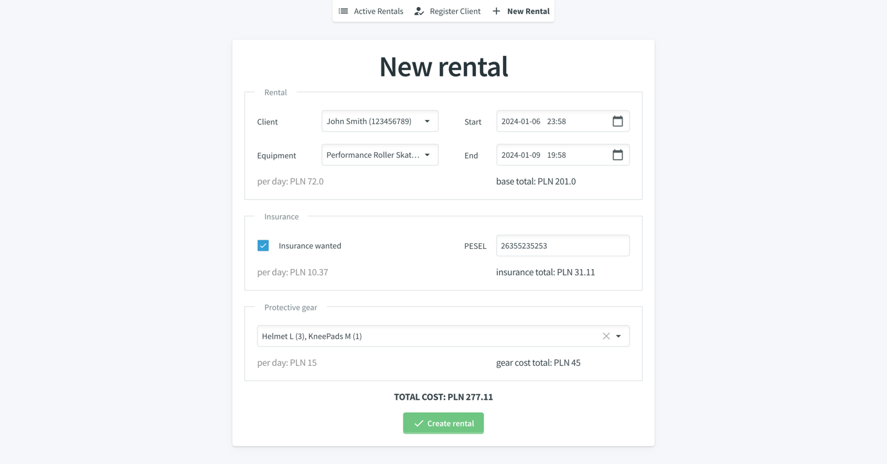
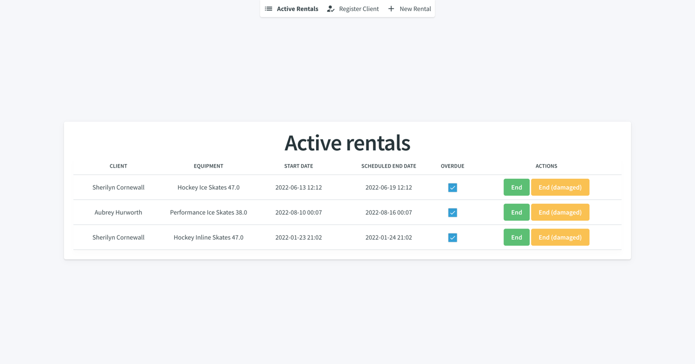
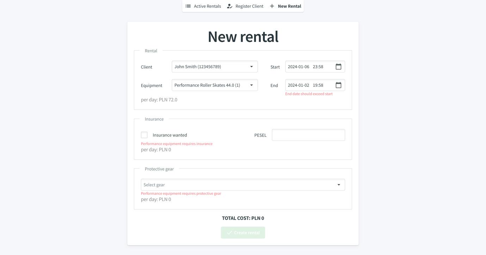
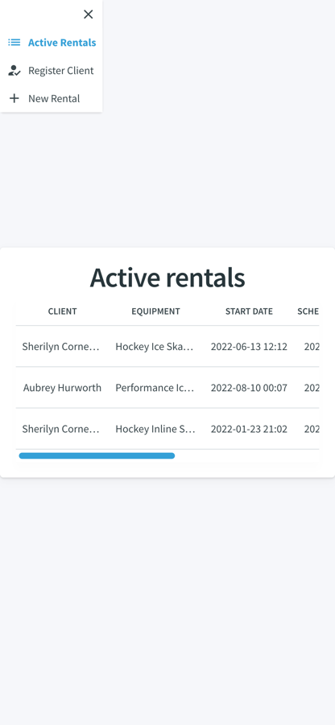
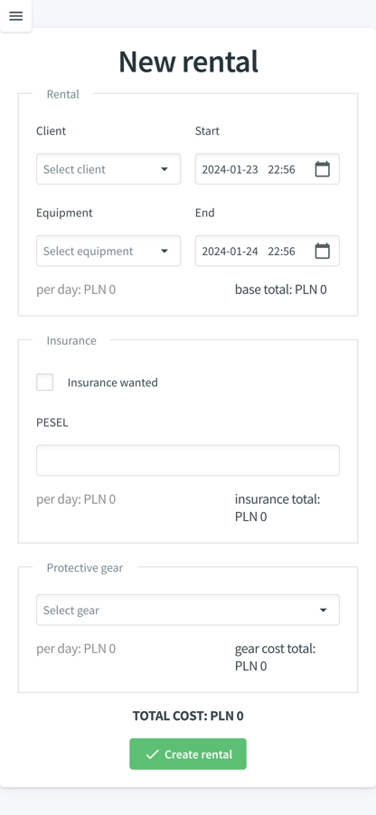
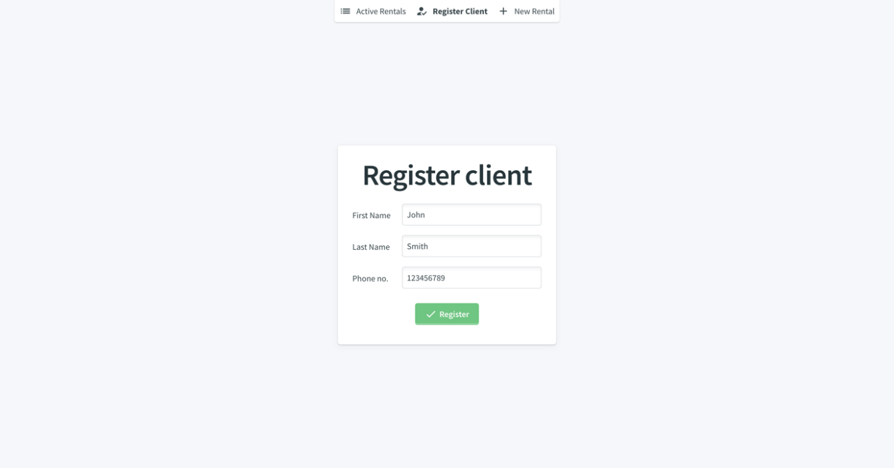
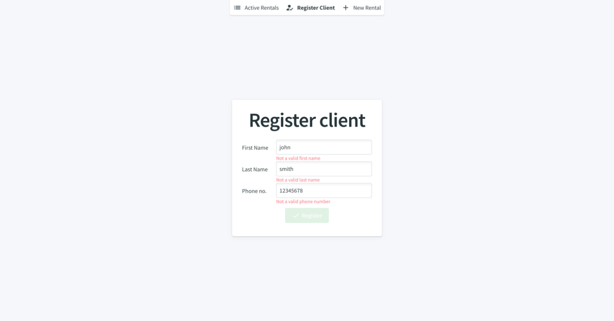
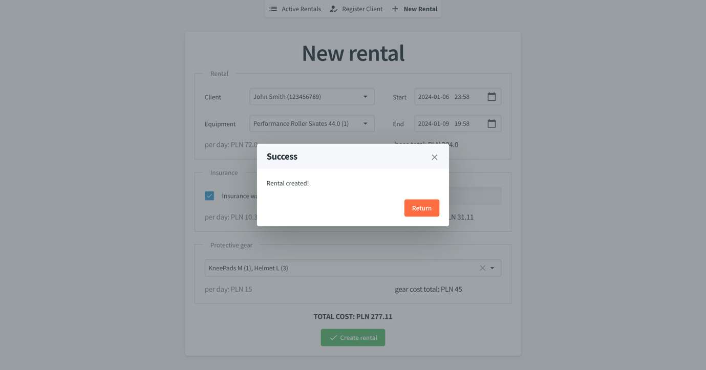
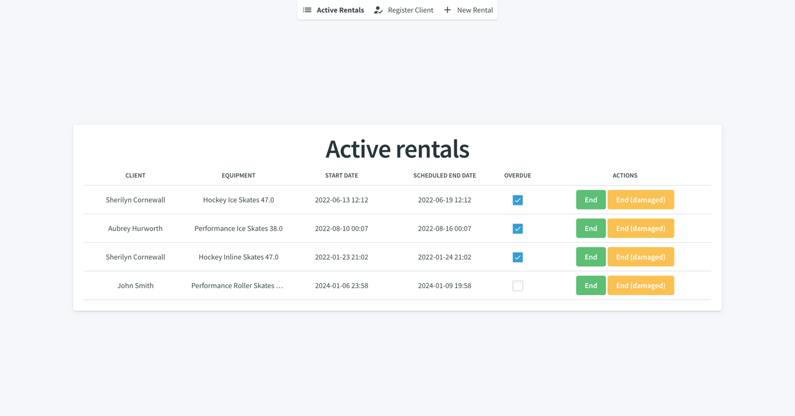

# RentalApp - Blazor WebAssembly Equipment Rental System

A full-stack sports equipment rental management system built with **Blazor WebAssembly** and **ASP.NET Core**. It handles client registration, equipment inventory, rental creation with dynamic cost calculation, optional insurance, and protective gear - all through a clean, responsive web interface.

Built as part of an engineering thesis on WebAssembly and its practical applications ([PJAIT](https://www.pja.edu.pl/en/), January 2024).



## Features

**Rental management**
- Create rentals with client selection, equipment picker, and date range
- Dynamic cost calculation (equipment hourly fee x rental duration)
- Track active rentals with overdue detection
- End rentals normally or mark equipment as damaged (PLN 5/hour overdue surcharge)

**Client registration**
- Register clients with name and phone number
- Input validation (capitalization, 9-digit phone format, uniqueness)

**Insurance system**
- Optional insurance with dynamic pricing based on equipment type and hourly fee
- Mandatory for Performance-grade equipment
- 15% discount if the client's last 10 rentals were damage-free
- Requires PESEL (Polish national ID number)

**Protective gear**
- Multi-select helmets, knee pads, and gloves in various sizes
- Mandatory for Performance equipment
- Per-day pricing (helmets PLN 10, knee pads/gloves PLN 5)

**Equipment inventory**
- Three skate types: ice skates, inline skates, roller skates
- Equipment attributes: size, purpose (Performance/Figure/Hockey), blade material, functional status
- Availability tracking - only non-rented items appear in dropdowns

**Responsive design**
- Adapts to desktop and mobile screen sizes via Radzen's layout system

## Screenshots

### Active rentals dashboard


### Rental creation with validation


### Mobile views
<p float="left">
  
  
</p>

<details>
<summary>More screenshots</summary>

### Client registration



### Rental creation success


### Active rentals after adding a new rental


</details>

## Architecture

The application follows the **Blazor WebAssembly Hosted** model with three projects:

| Project | Role |
|---|---|
| **RentalApp.Client** | Blazor WebAssembly front-end (runs in the browser) |
| **RentalApp.Server** | ASP.NET Core Web API back-end |
| **RentalApp.Shared** | Shared domain models used by both Client and Server |

### Domain model

The equipment system uses an inheritance hierarchy:

```
SportsEquipment (base)
├── IceSkates
├── InlineSkates
└── RollerSkates
```

Roles use bitwise flags (`Client=1`, `Attendant=2`, `Mechanic=4`, `Owner=8`), allowing a single person to hold multiple roles.

### API

RESTful endpoints with filtering and sorting:

- `GET /api/Rentals?activeOnly=true` - active rentals
- `GET /api/Equipment?availableOnly=true` - available equipment
- `GET /api/People?role=Client` - filter by role
- `GET /api/ProtectiveGear?availableOnly=true` - available gear
- Full CRUD on all resources
- Swagger/OpenAPI documentation via NSwag

## Tech stack

**Client-side**
- [Blazor WebAssembly](https://learn.microsoft.com/en-us/aspnet/core/blazor/) (.NET 8.0)
- [Radzen Blazor](https://blazor.radzen.com/) - UI component library

**Server-side**
- ASP.NET Core Web API (.NET 8.0)
- Entity Framework Core 8.0 (SQLite)
- [NSwag](https://github.com/RicoSuter/NSwag) - OpenAPI/Swagger documentation

## Getting started

### Prerequisites

- [.NET 8.0 SDK](https://dotnet.microsoft.com/download/dotnet/8.0)

### Setup

1. **Clone the repository**
   ```bash
   git clone https://github.com/karolpela/blazor-rental-app.git
   cd blazor-rental-app
   ```

2. **Run the application**
   ```bash
   dotnet run --project Server
   ```

   The database is SQLite-based and migrations run automatically on startup. Sample seed data (clients, equipment, protective gear) is included.

3. **Open the app** at `https://localhost:7103` (or the URL shown in the console).

4. **Explore the API** at `/swagger`.

## Credits

- [Radzen Blazor](https://blazor.radzen.com/) - UI components
